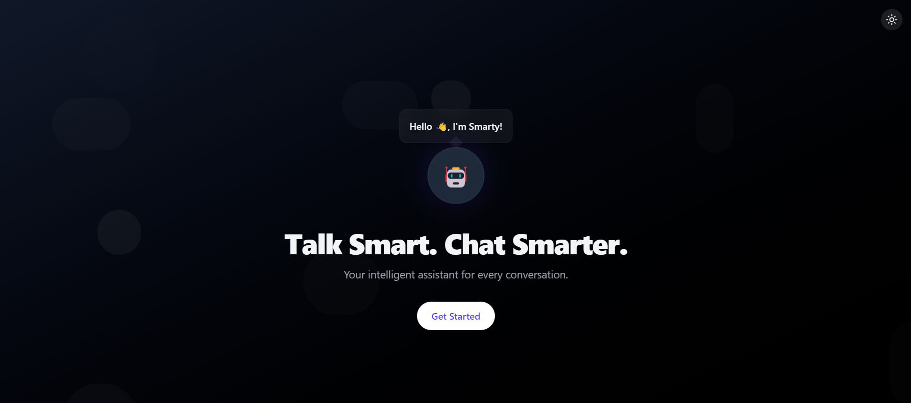
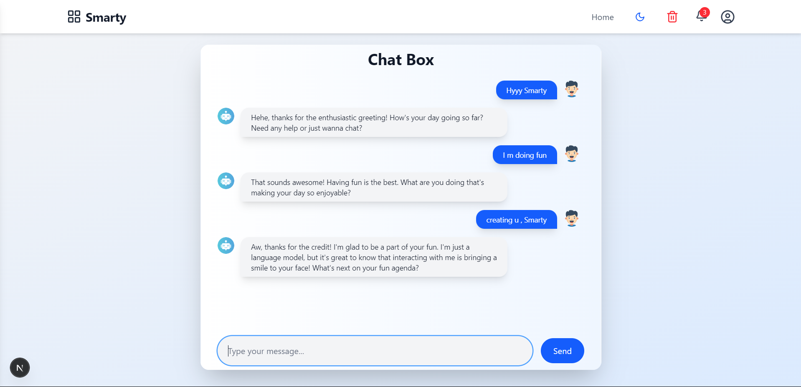
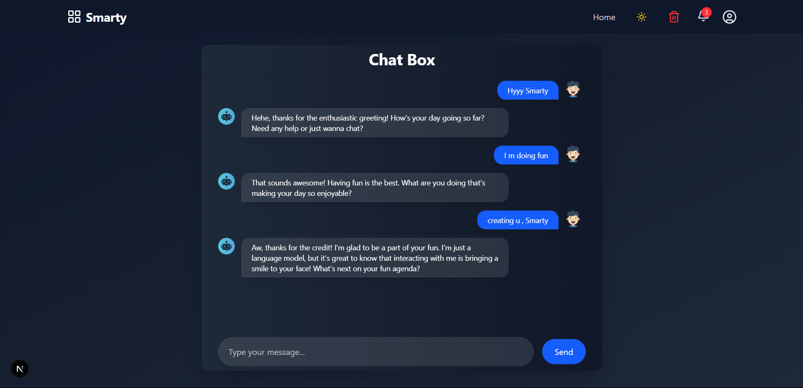

# 🤖 Smarty — Your Smart AI Chat Assistant


Smarty is a sleek, fast, and privacy-respecting AI chatbot built with **Next.js**, **Tailwind CSS**, and **OpenAI API**. Designed to feel premium, it supports light/dark modes, custom styling, and interactive UI—just like ChatGPT, but tailored to your own needs.

---

## 🌟 Features

- 💬 Smooth real-time chat experience  
- 🌗 Elegant Light & Dark mode with emoji toggle  
- 📂 Sidebar with `New Chat` & `Chat History`  
- 🔕 Smart notification with red-dot indicator  
- ✨ Beautiful, responsive design with animations  
- ⚙️ Built with Next.js App Router & Tailwind CSS  
- 🔐 No database required (yet) — works fully local!

---

## 🚀 Demo

> 🧠 Try it live: [smartyy.vercel.app](https://smartyy.vercel.app)



---

## 🛠️ Tech Stack

- [Next.js 14+](https://nextjs.org/)
- [Tailwind CSS](https://tailwindcss.com/)
- [OpenAI API](https://platform.openai.com/)
- [React Context + Hooks](https://reactjs.org/)
- [Lottie Animations](https://lottiefiles.com/)
- [Vercel Deployment](https://vercel.com/)

---

## 📦 Installation

```bash
git clone https://github.com/yourusername/smarty.git
cd smarty
npm install
npm run dev
```

> ⚠️ Make sure to add your **OpenAI API Key** in `.env.local`:

```
OPENAI_API_KEY=your-key-here
```

---

## 🧠 Folder Structure

```
/app           → Next.js App Router Pages  
/components    → Reusable UI Components  
/context       → Theme & Notification Contexts  
/public        → Static assets (e.g., animations, icons)  
/styles        → Tailwind + Custom CSS  
```

---

## 📸 Screenshots

| Light Mode                             | Dark Mode                              |
| ------------------------------------- | -------------------------------------- |
|          |             |

---

## ✅ Upcoming Features

- 🧠 Chat memory & context saving  
- 🗃️ Export chat history  
- 🪄 More Lottie animations  
- 🌐 Multi-language support  

---

## 📄 License

MIT © [Jitesh Bhakat](https://github.com/jiteshbhakat)

> 💡 *Smarty is a personal AI companion — use it, customize it, and make it yours.*
